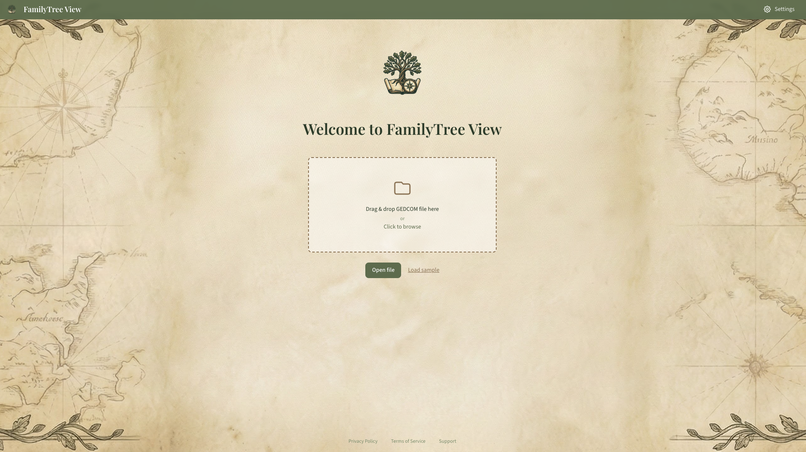
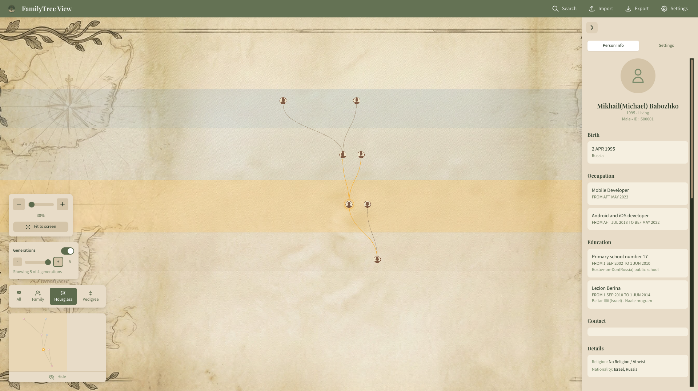
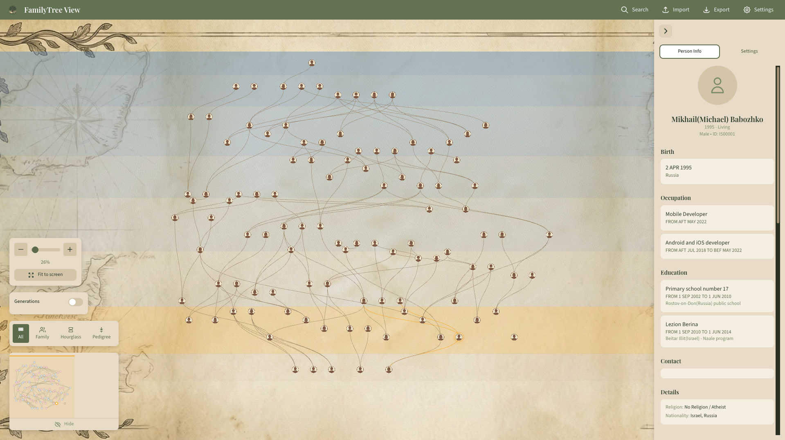

# Family Tree View

A privacy-focused, high-performance genealogy visualization app that renders family trees on an infinite canvas with seamless zoom — like Google Maps for your ancestry.



## Why This App?

This project was born from my own journey into family history research. I couldn't find a tool that was both powerful and intuitive — existing solutions felt either overly complex or stuck in the past. I wanted something that felt as natural as navigating a map: smooth panning, seamless zooming, and instant access to any ancestor.

**Family Tree View** brings that vision to life: drop in your GEDCOM file and explore your lineage on a beautiful infinite canvas.

## Screenshots

| Tree View | Person Details |
|-----------|----------------|
|  |  |

## Key Features

- **Privacy First** — All data processing happens locally in your browser. Your family data never leaves your device.
- **Infinite Canvas** — Pan and zoom seamlessly through your family tree, from a bird's-eye view to detailed individual cards.
- **High Performance** — Optimized Canvas rendering handles trees with 10,000+ people at 60fps.
- **Multiple View Modes** — Switch between All Relatives, Family, Hourglass, and Pedigree views.
- **Mobile Friendly** — Touch gestures, bottom sheets, and responsive layout for phones and tablets.
- **Export Options** — Save your tree as PNG, PDF, or SVG for printing or sharing.
- **Multi-language** — Available in English, Russian, Hebrew, and Spanish.

## Tech Stack

| Layer | Technology |
|-------|------------|
| Framework | React 18 + TypeScript |
| Build | Vite 5 |
| State | Zustand |
| Styling | Tailwind CSS |
| Canvas | Custom HTML5 Canvas 2D engine |
| Layout | d3-hierarchy + d3-shape |
| GEDCOM | parse-gedcom |
| Export | html2canvas + jspdf |
| i18n | i18next |

## Getting Started

```bash
# Install dependencies
npm install

# Start development server
npm run dev

# Build for production
npm run build
```

Then open [http://localhost:5173](http://localhost:5173) and drag in your GEDCOM file — or try the sample tree to explore.

## GEDCOM Support

Imports standard GEDCOM 5.5.1 files exported from:
- Ancestry.com
- FamilySearch
- MyHeritage
- Gramps
- And most other genealogy software

## License

MIT